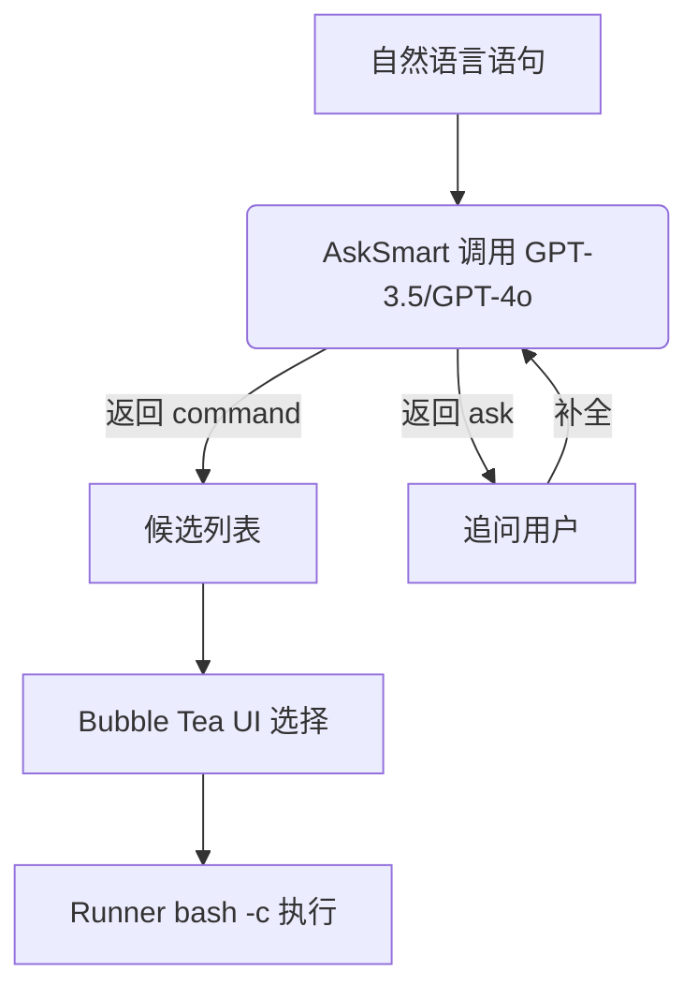

# Termi

自然语言转 Bash 命令行助手

Termi 让你可以用自然语言描述想要做的事情，它会调用 OpenAI GPT-4o / GPT-3.5 将其翻译成可以直接粘贴执行的 Bash 命令，并在终端内提供交互式候选选择与一键执行。

---

## 功能亮点

1. **自然语言 ➜ 命令行**：输入任何中文需求，Termi 会返回可直接运行的 Bash 命令。
2. **智能追问**：当关键信息缺失时，LLM 会自动以中文向你提问，补全上下文。
3. **TUI 候选列表**：基于 [Bubble Tea](https://github.com/charmbracelet/bubbletea) 的终端 UI，显示多条候选命令，↑/↓ 选择，Enter 执行。
4. **完整交互执行**：命令通过 `bash -c` 启动，标准输入/输出与当前终端直连，体验与手动输入无异。
5. **零本地规则依赖**：所有解析逻辑均在 LLM 中完成，代码简洁易于扩展。

---

## 快速开始

### 1. 安装 Go

确保本机拥有 **Go ≥ 1.23**（推荐使用最新版）。

```bash
$ go version
```

### 2. 获取源码

```bash
$ git clone https://github.com/aimuz/termi.git
$ cd termi
```

### 3. 设置 OpenAI API Key

Termi 依赖 OpenAI ChatCompletion API。请在 shell 中导出环境变量：

```bash
$ export OPENAI_API_KEY="sk-..."
```

建议将以上命令写入 `~/.zshrc` / `~/.bashrc` 以便长期生效。

### 4. 编译 / 安装

```bash
# 在当前目录编译二进制
$ go build -o termi ./cmd/termi

# 或直接安装到 GOPATH/bin，并加入 PATH
$ go install termi.sh/termi/cmd/termi@latest
```

### 5. 使用示例

```bash
$ termi 我想对 baidu.com 发起 ping

候选命令 (↑/↓ 选择, Enter 确定, q 退出):
➜ 1. ping -c 4 baidu.com [llm]
  2. ping baidu.com [llm]
```

按 **Enter** 即开始执行，输出与你在终端直接输入 `ping -c 4 baidu.com` 完全一致。

> 如果缺少参数，Termi 会先向你提问：
>
> ```bash
> $ termi 删除文件
> 你要删除哪个文件(支持通配符)? _
> ```
>
> 填写后继续生成命令并进入候选界面。

---

## 工作原理



核心包概览：

- `internal/llm` OpenAI API 封装，提供 `Ask` / `AskCommand` / `AskSmart` 三种模式。
- `internal/ui` Bubble Tea TUI，实现候选展示与加载动画。
- `internal/runner` 包装 `exec.Command`，负责命令执行与 I/O 直通。
- `internal/suggest` 候选命名空间（预留本地规则扩展）。
- `cmd/termi/main.go` CLI 入口，整合各组件。

---

## 常见问题 FAQ

1. **为什么提示 "OpenAI API KEY 未配置"？**  
   请检查是否已设置 `OPENAI_API_KEY`，且网络能够访问 api.openai.com。
2. **支持 Windows 吗？**  
   理论上可以，但尚未充分测试，欢迎 PR。
3. **支持其他 LLM 吗？**  
   目前仅内置 OpenAI，若要接入本地模型，可实现 `llm` 同名接口替换。

---

## 贡献指南

欢迎提交 Issue、PR，或在 Discussions 中交流新点子。

1. Fork 仓库并创建分支；
2. 保持 `go vet`, `go test` 通过；
3. 提交 PR 时附上说明截图 / 文字。

---

## Roadmap

- [ ] 支持本地命令规则建议
- [ ] 接入更多 LLM (Gemini, Llama-cpp, Azure OpenAI)
- [ ] 增加批量模式，直接输出命令而不执行
- [ ] 增加 `--dry-run` / `--yes` 等安全选项

---

## License

MIT © 2025 aimuz & Contributors 
